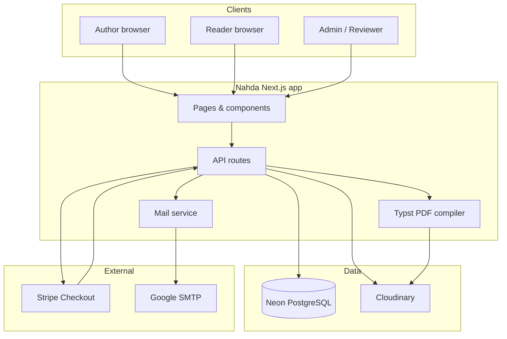
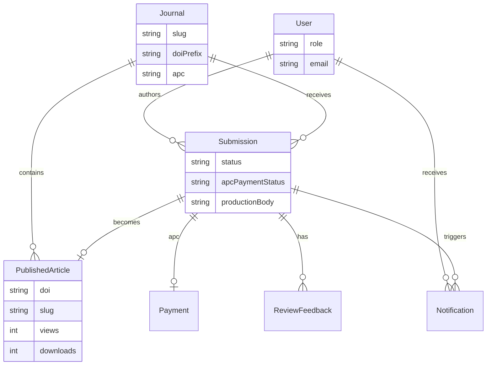
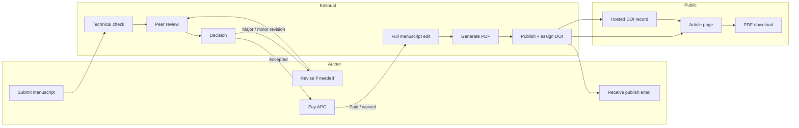
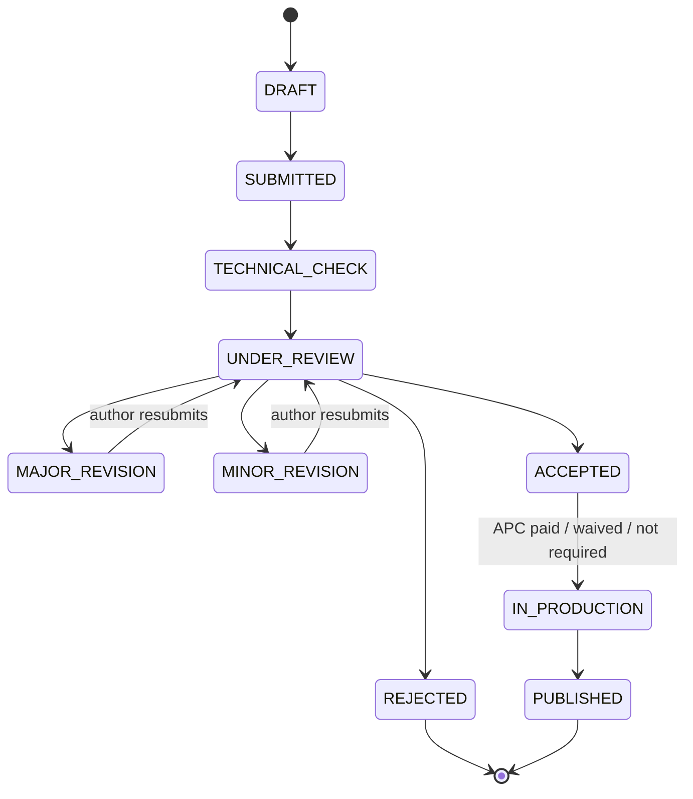
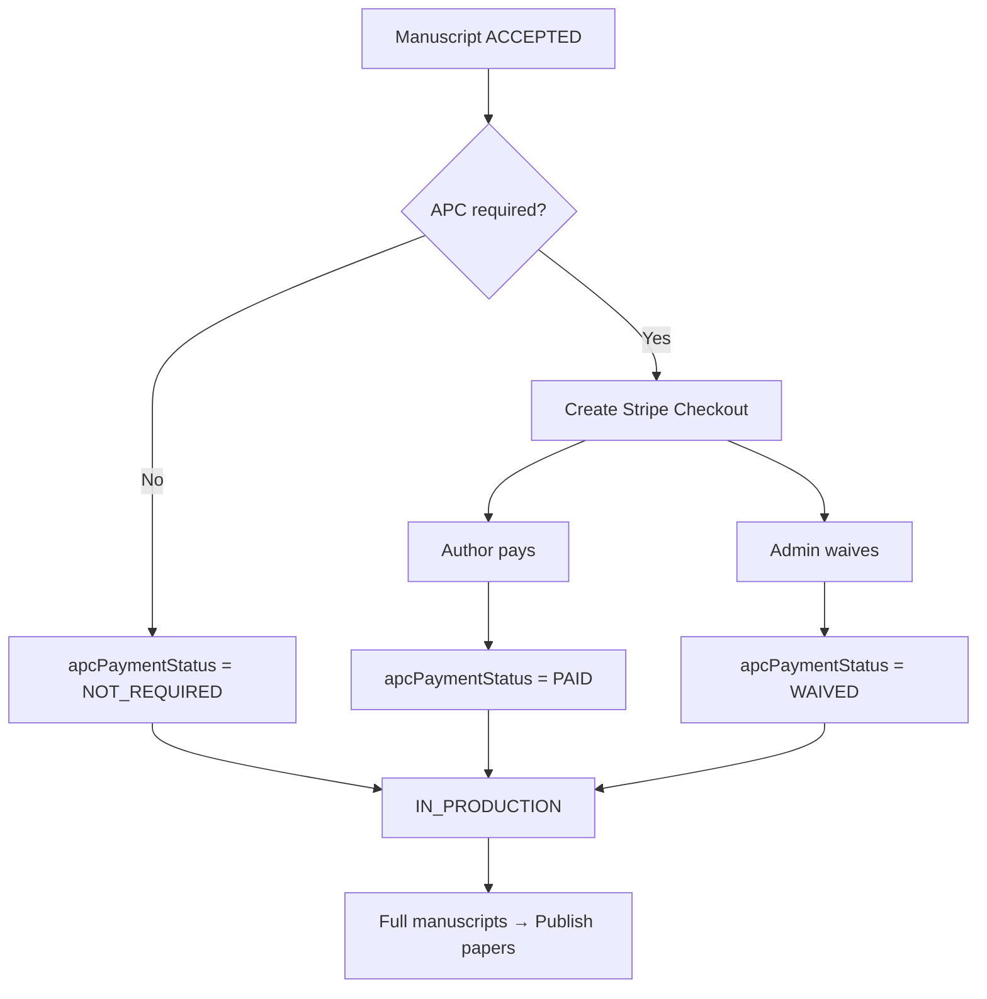
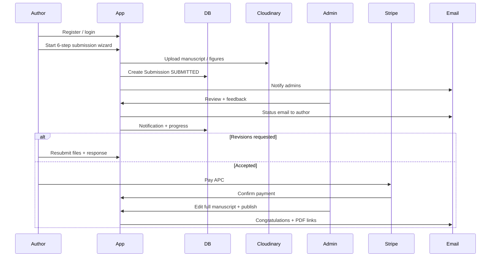
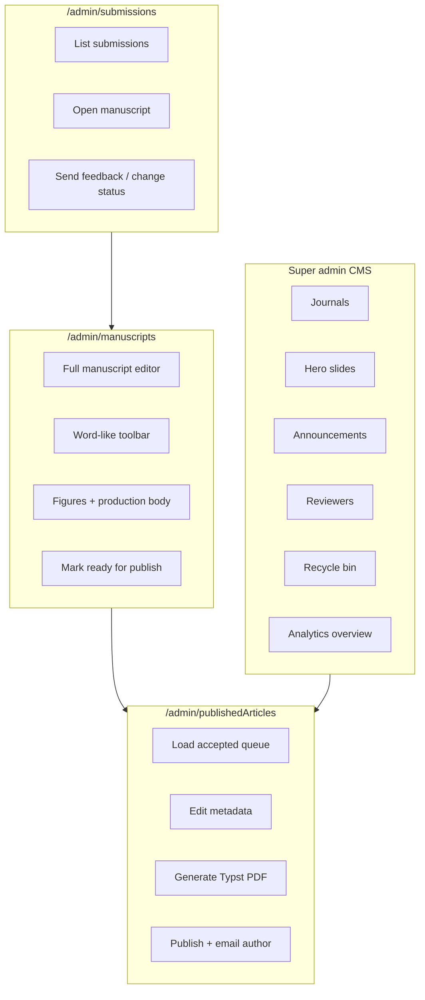

# Nahda Publications

Academic publishing platform for multi-journal manuscript submission, peer review, APC payment, production editing, Typst PDF generation, DOI hosting, and open publication.

Built with **Next.js**, **Prisma**, **Neon PostgreSQL**, **Cloudinary**, **Stripe**, **Nodemailer**, and a **Typst** PDF engine.

---

## Table of contents

- [Overview](#overview)
- [Tech stack](#tech-stack)
- [System architecture](#system-architecture)
- [End-to-end publishing pipeline](#end-to-end-publishing-pipeline)
- [Author workflow](#author-workflow)
- [Admin & reviewer workflow](#admin--reviewer-workflow)
- [DOI hosting](#doi-hosting)
- [Key features](#key-features)
- [Project structure](#project-structure)
- [Setup](#setup)
- [Roles & URLs](#roles--urls)
- [Environment variables](#environment-variables)
- [Scripts](#scripts)

---

## Overview

Nahda Publications is a full journal house platform:

| Audience | What they do |
| --- | --- |
| **Authors** | Register, submit manuscripts, track review, pay APC, download published PDFs |
| **Reviewers / editors** | Review inbox, request revisions, accept/reject, prepare full manuscripts |
| **Super admins** | Journals CMS, hero slides, announcements, reviewers, recycle bin, analytics |

Public readers browse journals, articles, search by keyword/DOI, and resolve Nahda-hosted DOIs.

---

## Tech stack

```text
┌─────────────────────────────────────────────────────────────┐
│                        Frontend                             │
│  Next.js App Router · React 19 · Tailwind CSS v4            │
└────────────────────────────┬────────────────────────────────┘
                             │
┌────────────────────────────▼────────────────────────────────┐
│                     API / Server                            │
│  Next.js Route Handlers · JWT sessions · Zod validation     │
└──┬──────────┬──────────┬──────────┬──────────┬──────────────┘
   │          │          │          │          │
   ▼          ▼          ▼          ▼          ▼
PostgreSQL  Cloudinary  Stripe    SMTP      Typst
  (Neon)    (uploads)  (APC)   (Gmail)   (PDF engine)
```

| Layer | Choice |
| --- | --- |
| App framework | Next.js 16 (App Router) |
| Language | TypeScript |
| Database | Neon PostgreSQL via Prisma 7 + `@prisma/adapter-pg` |
| Auth | Custom JWT (`jose`) — author + admin sessions |
| Files | Cloudinary (manuscripts, figures, PDFs, logos) |
| Payments | Stripe Checkout (APC after acceptance) |
| Email | Nodemailer / Google SMTP |
| PDF | Typst (`@myriaddreamin/typst-ts-node-compiler`) |
| UI | Tailwind CSS, custom admin shell |

---

## System architecture



### High-level data model



---

## End-to-end publishing pipeline

This is the core lifecycle from upload to live article + DOI.



### Submission status machine



### APC payment gate



---

## Author workflow



**Author surfaces**

- `/register`, `/login`, `/forgot-password`, `/reset-password`
- `/dashboard` — manuscripts, action required, filters
- `/submissions/new` — 6-step wizard
- `/submissions/[id]` — track, resubmit, pay APC, download when published
- `/notifications`

---

## Admin & reviewer workflow



**Admin overview analytics** (`/admin`)

- Totals: articles, views, downloads, citations
- 6-month reach trend chart
- Share-by-journal donut
- Views vs downloads engagement bars
- Most viewed / most downloaded rankings

**Soft delete / recycle bin**

- Published articles and submissions can be moved to recycle bin (`deletedAt`)
- “Edit manuscript” unpublishes for revision, then republish restores the same DOI/slug
- Super admins can restore or permanently purge

---

## DOI hosting

Nahda hosts its own DOI records (prefix `10.58000/...`) — not Crossref/`doi.org` resolution.

```mermaid
flowchart LR
  Click[User clicks DOI] --> Path["/doi/10.58000/njafs.2026.0003"]
  Path --> Lookup{Article found?}
  Lookup -->|Yes| Record[Nahda DOI record page]
  Record --> Article[/articles/slug]
  Record --> PDF[Download PDF]
  Lookup -->|No| Err[DOI error page]
  Path -->|?download=1| PDF
```

| Link | Behavior |
| --- | --- |
| `/doi/{doi}` | Hosted DOI record bound to the paper |
| `/doi/{doi}?download=1` | PDF download (increments downloads) |
| Unknown DOI | Friendly “DOI error” page on Nahda |
| Cite → Open DOI record | Opens **local** `/doi/...` (not doi.org) |

Views increment on article page visits; downloads increment on PDF retrieval.

---

## Key features

### Public site
- Homepage hero carousel, publishing pathway, latest articles, journals
- Journals list + journal detail (aims, board, issues, articles)
- Article masthead (ACS-inspired), metrics, cite card, keywords
- Search by title / author / keyword / DOI + journal filter
- Mobile-responsive chrome (hamburger nav, stacked layouts)

### Publishing engine
- Typst ACS-style article template (journal colors, logo, footer DOI bar)
- HTML preview aligned with PDF
- Cloudinary-hosted published PDFs
- Congratulatory author email on publish

### Admin
- Collapsible sidebar, notifications with polling
- Manuscript Word-like editor (fonts, align, highlight, tables, figures)
- Publish queue with DOI allocation
- Analytics charts on overview

---

## Project structure

```text
atlas-academic-publishing/
├── prisma/
│   ├── schema.prisma          # Data model
│   └── seed-nahda-journals.ts
├── public/brand/              # Nahda logos
├── templates/atlas-article.typ
├── src/
│   ├── app/
│   │   ├── page.tsx           # Public homepage
│   │   ├── articles/          # Article list + detail
│   │   ├── journals/          # Journal catalogue
│   │   ├── doi/[...path]/     # Hosted DOI records
│   │   ├── dashboard/         # Author dashboard
│   │   ├── submissions/       # Wizard + detail
│   │   ├── admin/             # Admin shell pages
│   │   └── api/               # Route handlers
│   ├── components/            # UI (masthead, editor, charts, …)
│   ├── lib/
│   │   ├── db.ts              # Prisma client
│   │   ├── doi.ts             # DOI allocate / resolve
│   │   ├── mail.ts            # Email templates
│   │   ├── typst-atlas.ts     # PDF compilation
│   │   ├── recycle-bin.ts
│   │   └── …
│   └── generated/prisma/      # Prisma client output
└── README.md
```

---

## Setup

### 1. Environment

```bash
cp .env.example .env
```

Fill in Neon, auth, Cloudinary, SMTP, Stripe, and app URL values (see [Environment variables](#environment-variables)).

### 2. Install & database

```bash
npm install
npm run db:push
# or: npm run db:migrate
```

Optional journal seed:

```bash
npm run db:seed:nahda
```

### 3. Run

```bash
npm run dev
```

Open [http://localhost:3000](http://localhost:3000).

### 4. First super admin

Visit `/admin/register` **only when no super admin exists**, then use `/admin/login`.

---

## Roles & URLs

| Role | Entry | Main areas |
| --- | --- | --- |
| Author | `/register`, `/login` | Dashboard, submissions, notifications |
| Reviewer | `/admin/login` | Inbox, manuscripts, publish queue |
| Super admin | `/admin/login` | All of the above + journals, hero, announcements, reviewers, recycle bin, analytics |

**Public**

- `/` · `/journals` · `/journals/[slug]` · `/articles` · `/articles/[slug]`
- `/search` · `/doi/[...path]` · `/about` · `/help` · `/authors/*`

**Author**

- `/dashboard` · `/submissions/new` · `/submissions/[id]` · `/profile` · `/notifications`

**Admin**

- `/admin` — overview + analytics charts  
- `/admin/submissions` — review inbox  
- `/admin/manuscripts` — full manuscript production  
- `/admin/publishedArticles` — publish accepted papers  
- `/admin/journals` · `/admin/articles` · `/admin/hero` · `/admin/announcements`  
- `/admin/reviewers` · `/admin/recycle-bin`

---

## Environment variables

| Variable | Purpose |
| --- | --- |
| `DATABASE_URL` | Neon PostgreSQL connection string |
| `AUTH_SECRET` | JWT signing secret |
| `CLOUDINARY_CLOUD_NAME` / `CLOUDINARY_API_KEY` / `CLOUDINARY_API_SECRET` | Uploads |
| `SMTP_HOST` / `SMTP_PORT` / `SMTP_USER` / `SMTP_PASS` / `SMTP_FROM` | Transactional email |
| `NEXT_PUBLIC_APP_URL` | Canonical app URL (emails, Stripe redirects, DOI/article links) |
| `STRIPE_SECRET_KEY` / `NEXT_PUBLIC_STRIPE_PUBLISHABLE_KEY` | APC Checkout |
| `DEFAULT_APC_CENTS` | Fallback APC when journal has no amount |

See `.env.example` for placeholders. Never commit real secrets.

---

## Scripts

| Command | Description |
| --- | --- |
| `npm run dev` | Local development server |
| `npm run build` | `prisma generate` + Next.js production build |
| `npm start` | Run production server |
| `npm run db:generate` | Generate Prisma client |
| `npm run db:push` | Push schema to database |
| `npm run db:migrate` | Run Prisma migrations |
| `npm run db:studio` | Open Prisma Studio |
| `npm run db:seed:nahda` | Seed Nahda journals |

---

## Publishing checklist (ops)

1. Author submits → appears in **Submission inbox**
2. Reviewer sends feedback / moves status
3. On **Accepted**, author pays APC (or waiver / not required)
4. Editor opens **Full manuscripts**, edits body/figures, marks ready
5. **Publish papers**: confirm metadata → generate Nahda PDF → publish
6. System assigns DOI, creates public article, emails author, records metrics

---

## License & branding

© Nahda Publications. Platform branding uses assets under `public/brand/`.

Scholarly publishing for researchers worldwide.
